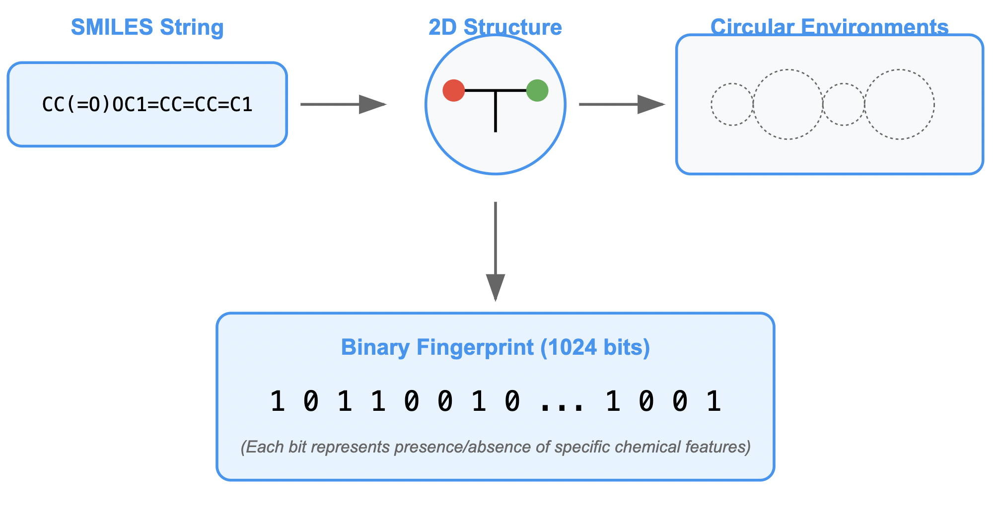
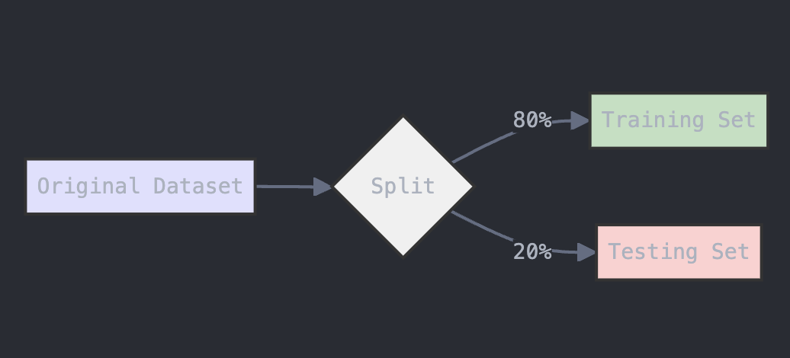

Machine learning (ML) is a subfield of artificial intelligence (AI) focused on developing algorithms and statistical models that enable computers to learn from and make decisions based on data. Unlike traditional programming, where explicit instructions are given, machine learning systems identify patterns and insights from large datasets, improving their performance over time through experience.

ML encompasses various techniques, including supervised learning, where models are trained on labeled data to predict outcomes; unsupervised learning, which involves discovering hidden patterns or groupings within unlabeled data; and reinforcement learning, where models learn optimal actions through trial and error in dynamic environments. These methods are applied across diverse domains, from natural language processing and computer vision to recommendation systems and autonomous vehicles, revolutionizing how technology interacts with the world.

## 3.1 Decision Tree and Random Forest

### 3.1.1 Decision Trees

**Decision Trees** are intuitive and powerful models used in machine
learning to make predictions and decisions. Think of it like playing a
game of 20 questions, where each question helps you narrow down the
possibilities. Decision trees function similarly; they break down a
complex decision into a series of simpler questions based on the
data.

Each question, referred to as a \"decision,\" relies on a specific
characteristic or feature of the data. For instance, if you\'re trying
to determine whether a fruit is an apple or an orange, the initial
question might be, \"Is the fruit\'s color red or orange?\" Depending on
the answer, you might follow up with another question---such as, \"Is
the fruit\'s size small or large?\" This questioning process continues
until you narrow it down to a final answer (e.g., the fruit is either an
apple or an orange).

In a decision tree, these questions are represented as nodes, and the
possible answers lead to different branches. The final outcomes are
represented at the end of each branch, known as leaf nodes. One of the
key advantages of decision trees is their clarity and ease of
understanding---much like a flowchart. However, they can also be prone
to overfitting, especially when dealing with complex datasets that have
many features. Overfitting occurs when a model performs exceptionally
well on training data but fails to generalize to new or unseen
data.

In summary, decision trees offer an intuitive approach to making
predictions and decisions, but caution is required to prevent them from
becoming overly complicated and tailored too closely to the training
data.

### 3.1.2 Random Forest

**Random Forests** address the limitations of decision trees by
utilizing an ensemble of multiple trees instead of relying on a single
one. Imagine you're gathering opinions about a game outcome from a group
of people; rather than trusting just one person\'s guess, you ask
everyone and then take the most common answer. This is the essence of
how a Random Forest operates.

In a Random Forest, numerous decision trees are constructed, each
making its own predictions. However, a key difference is that each tree
is built using a different subset of the data and considers different
features of the data. This technique, known as bagging (Bootstrap
Aggregating), allows each tree to provide a unique perspective, which
collectively leads to a more reliable prediction.

When making a final prediction, the Random Forest aggregates the
predictions from all the trees. For classification tasks, it employs
majority voting to determine the final class label, while for regression
tasks, it averages the results.

Random Forests typically outperform individual decision trees because
they are less likely to overfit the data. By combining multiple trees,
they achieve a balance between model complexity and predictive
performance on unseen data.

#### **Real-Life Analogy**

Consider Andrew, who wants to decide on a destination for his year-long
vacation. He starts by asking his close friends for suggestions. The
first friend asks Andrew about his past travel preferences, using his
answers to recommend a destination. This is akin to a decision tree
approach---one friend following a rule-based decision process.

Next, Andrew consults more friends, each of whom poses different
questions to gather recommendations. Finally, Andrew chooses the places
suggested most frequently by his friends, mirroring the Random Forest
algorithm\'s method of aggregating multiple decision trees\'
outputs.

### **Implementing Random Forest on the BBBP Dataset**

This guide demonstrates how to implement a **Random Forest** algorithm in Python using the **BBBP (Blood–Brain Barrier Permeability)** dataset. The **BBBP dataset** is used in cheminformatics to predict whether a compound can cross the blood-brain barrier based on its chemical structure.

The dataset contains **SMILES** (Simplified Molecular Input Line Entry System) strings representing chemical compounds, and a **target column** that indicates whether the compound is permeable to the blood-brain barrier or not.

The goal is to predict whether a given chemical compound will cross the blood-brain barrier, based on its molecular structure. This guide walks you through downloading the dataset, processing it, and training a **Random Forest** model.

**Step 1: Install RDKit (Required for SMILES to Fingerprint Conversion)**

We need to use the RDKit library, which is essential for converting **SMILES strings** into molecular fingerprints, a numerical representation of the molecule.

<pre>
    <code class="python">
# Install the RDKit package via conda-forge
!pip install -q condacolab
import condacolab
condacolab.install()

# Now install RDKit
!mamba install -c conda-forge rdkit -y

# Import RDKit and check if it's installed successfully
from rdkit import Chem
print("RDKit is successfully installed!")
    </code>
</pre>

**Step 2: Download the BBBP Dataset from Kaggle**

The **BBBP dataset** is hosted on Kaggle, a popular platform for datasets and machine learning competitions. To access the dataset, you need a Kaggle account and an API key for authentication. Here's how you can set it up:

***Step 2.1: Create a Kaggle Account***
1. Visit Kaggle and create an account if you don't already have one.
2. Once you're logged in, go to your profile by clicking on your profile picture in the top right corner, and select My Account.

***Step 2.2: Set Up the Kaggle API Key***
1. Scroll down to the section labeled API on your account page.
2. Click on the button "Create New API Token". This will download a file named kaggle.json to your computer.
3. Keep this file safe! It contains your API key, which you'll use to authenticate when downloading datasets.

***Step 2.3: Upload the Kaggle API Key***
Once you have the kaggle.json file, you need to upload it to your Python environment:

1. If you're using a notebook environment like Google Colab, use the code below to upload the file:
<pre> 
    <code class="python"> 
# Upload the kaggle.json file from google.colab import 
files uploaded = files.upload() 
# Move the file to the right directory for authentication 
!mkdir -p ~/.kaggle !mv kaggle.json ~/.kaggle/ !chmod 600 ~/.kaggle/kaggle.json 
    </code> 
</pre>

2. If you're using a local Jupyter Notebook:
Place the kaggle.json file in a folder named .kaggle within your home directory:
    a. On Windows: Place it in C:\Users\<YourUsername>\.kaggle.
    b. On Mac/Linux: Place it in ~/.kaggle.

***Step 2.4: Install the Required Libraries***
To interact with Kaggle and download the dataset, you need the Kaggle API client. Install it with the following command:

<pre> 
    <code class="python"> 
!pip install kaggle 
    </code> 
</pre>

***Step 2.5: Download the BBBP Dataset***
Now that the API key is set up, you can download the dataset using the Kaggle API:

<pre> 
    <code class="python"> 
# Download the BBBP dataset using the Kaggle API 
!kaggle datasets download -d priyanagda/bbbp-smiles 
# Unzip the downloaded file 
!unzip bbbp-smiles.zip -d bbbp_dataset 
    </code> 
</pre>
This code will:

1. Download the dataset into your environment.
2. Extract the dataset files into a folder named bbbp_dataset.

Step 2.6: Verify the Download
After downloading, check the dataset files to confirm that everything is in place:

<pre> 
    <code class="python"> 
# List the files in the dataset folder 
import os 
dataset_path = "bbbp_dataset" 
files = os.listdir(dataset_path) 
print("Files in the dataset:", files) 
    </code> 
</pre>

By following these steps, you will have successfully downloaded and extracted the BBBP dataset, ready for further analysis and processing. 

**Step 3: Load the BBBP Dataset**

After downloading the dataset, we'll load the **BBBP dataset** into a **pandas DataFrame**. The dataset contains the **SMILES strings** and the **target variable** (`p_np`), which indicates whether the compound can cross the blood-brain barrier (binary classification: `1` for permeable, `0` for non-permeable).

<pre>
    <code class="python">
import pandas as pd

# Load the BBBP dataset (adjust the filename if it's different)
data = pd.read_csv("bbbp.csv")  # Assuming the dataset is named bbbp.csv
print("Dataset Head:", data.head())
    </code>
</pre>

**Step 4: Convert SMILES to Molecular Fingerprints**

To use the **SMILES strings** for modeling, we need to convert them into **molecular fingerprints**. This process turns the chemical structures into a numerical format that can be fed into machine learning models. We’ll use **RDKit** to generate these fingerprints using the **Morgan Fingerprint** method.

<pre>
    <code class="python">
from rdkit import Chem
from rdkit.Chem import AllChem
import numpy as np

# Function to convert SMILES to molecular fingerprints
def featurize_molecule(smiles):
    mol = Chem.MolFromSmiles(smiles)
    if mol:
        return AllChem.GetMorganFingerprintAsBitVect(mol, 2, nBits=1024)
    else:
        return None

# Apply featurization to the dataset
features = [featurize_molecule(smi) for smi in data['smiles']]  # Replace 'smiles' with the actual column name if different
features = [list(fp) if fp is not None else np.zeros(1024) for fp in features]  # Handle missing data by filling with zeros
X = np.array(features)
y = data['p_np']  # Target column (1 for permeable, 0 for non-permeable)
    </code>
</pre>
The diagram below provides a visual representation of what this code does:

**Step 5: Split Data into Training and Testing Sets**

To evaluate the model, we need to split the data into training and testing sets. The **train_test_split** function from **scikit-learn** will handle this. We’ll use 80% of the data for training and 20% for testing.

<pre>
    <code class="python">
from sklearn.model_selection import train_test_split

# Split data into train and test sets (80% training, 20% testing)
X_train, X_test, y_train, y_test = train_test_split(X, y, test_size=0.2, random_state=42)
    </code>
</pre>
The diagram below provides a visual representation of what this code does:

**Step 6: Train the Random Forest Model**

We’ll use the **RandomForestClassifier** from **scikit-learn** to build the model. A Random Forest is an ensemble method that uses multiple decision trees to make predictions. The more trees (`n_estimators`) we use, the more robust the model will be, but the longer the model will take to run. For the most part, n_estimators is set to 100 in most versions of scikit-learn. However, for more complex datasets, higher values like 500 or 1000 may improve performance.

<pre>
    <code class="python">
from sklearn.ensemble import RandomForestClassifier

# Train a Random Forest classifier
rf_model = RandomForestClassifier(n_estimators=100, random_state=42)
rf_model.fit(X_train, y_train)
    </code>
</pre>

The diagram below provides a visual explanation of what is going on here:

**Step 7: Evaluate the Model**

After training the model, we’ll use the **test data** to evaluate its performance. We will print the accuracy and the classification report to assess the model’s precision, recall, and F1 score.

<pre>
    <code class="python">
from sklearn.metrics import accuracy_score, classification_report

# Predictions on the test set
y_pred = rf_model.predict(X_test)

# Evaluate accuracy and performance
accuracy = accuracy_score(y_test, y_pred)
print("Accuracy:", accuracy)
print("Classification Report:", classification_report(y_test, y_pred))
    </code>
</pre>

**Model Performance and Parameters**

- **Accuracy**: The proportion of correctly predicted instances out of all instances.
- **Classification Report**: Provides additional metrics like precision, recall, and F1 score.
  
In this case, we achieved an **accuracy score of ~87%**.

**Key Hyperparameters:**
- **n_estimators**: The number of trees in the Random Forest. More trees generally lead to better performance but also require more computational resources.
- **test_size**: The proportion of data used for testing. A larger test size gives a more reliable evaluation but reduces the amount of data used for training.
- **random_state**: Ensures reproducibility by initializing the random number generator to a fixed seed.

##### **Conclusion**

This guide demonstrated how to implement a Random Forest model to predict the **Blood–Brain Barrier Permeability (BBBP)** using the **BBBP dataset**. By converting **SMILES strings** to molecular fingerprints and using a **Random Forest classifier**, we were able to achieve an accuracy score of around **87%**.

Adjusting parameters like the number of trees (`n_estimators`) or the split ratio (`test_size`) can help improve the model's performance. Feel free to experiment with these parameters and explore other machine learning models for this task!

### Approaching Random Forest Problems

When tackling a classification or regression problem using the Random Forest algorithm, a systematic approach can enhance your chances of success. Here’s a step-by-step guide to effectively solve any Random Forest problem:

1. **Understand the Problem Domain**: Begin by thoroughly understanding the problem you are addressing. Identify the nature of the data and the specific goal—whether it's classification (e.g., predicting categories) or regression (e.g., predicting continuous values). Familiarize yourself with the dataset, including the features (independent variables) and the target variable (dependent variable).

2. **Data Collection and Preprocessing**: Gather the relevant dataset and perform necessary preprocessing steps. This may include handling missing values, encoding categorical variables, normalizing or standardizing numerical features, and removing any outliers. Proper data cleaning ensures that the model learns from quality data.

3. **Exploratory Data Analysis (EDA)**: Conduct an exploratory data analysis to understand the underlying patterns, distributions, and relationships within the data. Visualizations, such as scatter plots, histograms, and correlation matrices, can provide insights that inform feature selection and model tuning.

4. **Feature Selection and Engineering**: Identify the most relevant features for the model. This can be achieved through domain knowledge, statistical tests, or feature importance metrics from preliminary models. Consider creating new features through feature engineering to enhance model performance.

5. **Model Training and Parameter Tuning**: Split the dataset into training and testing sets, typically using an 80-20 or 70-30 ratio. Train the Random Forest model using the training data, adjusting parameters such as the number of trees (`n_estimators`), the maximum depth of the trees (`max_depth`), and the minimum number of samples required to split an internal node (`min_samples_split`). Utilize techniques like grid search or random search to find the optimal hyperparameters.

6. **Model Evaluation**: Once trained, evaluate the model's performance on the test set using appropriate metrics. For classification problems, metrics such as accuracy, precision, recall, F1 score, and ROC-AUC are valuable. For regression tasks, consider metrics like mean absolute error (MAE), mean squared error (MSE), and R-squared.

7. **Interpretation and Insights**: Analyze the model’s predictions and feature importance to derive actionable insights. Understanding which features contribute most to the model can guide decision-making and further improvements in the model or data collection.

8. **Iterate and Improve**: Based on the evaluation results, revisit the previous steps to refine your model. This may involve further feature engineering, collecting more data, or experimenting with different algorithms alongside Random Forest to compare performance.

9. **Deployment**: Once satisfied with the model's performance, prepare it for deployment. Ensure the model can process incoming data and make predictions in a real-world setting, and consider implementing monitoring tools to track its performance over time.

By following this structured approach, practitioners can effectively leverage the Random Forest algorithm to solve a wide variety of problems, ensuring thorough analysis, accurate predictions, and actionable insights.

### **Strengths and Weaknesses of Random Forest**

**Strengths:**

-   **Robustness**: Random Forests are less prone to overfitting
    compared to individual decision trees, making them more reliable for
    new data.

-   **Versatility**: They can handle both classification and regression
    tasks effectively.

-   **Feature Importance**: Random Forests provide insights into the
    significance of each feature in making predictions.

**Weaknesses:**

-   **Complexity**: The model can become complex, making it less
    interpretable than single decision trees.

-   **Resource Intensive**: Training a large number of trees can
    require significant computational resources and time.

-   **Slower Predictions**: While individual trees are quick to
    predict, aggregating predictions from multiple trees can slow down
    the prediction process.

## 3.2 Neural Network

A neural network is a computational model inspired by the neural structure of the human brain, designed to recognize patterns and learn from data. It consists of layers of interconnected nodes, or neurons, which process input data through weighted connections.

Structure: Neural networks typically include an input layer, one or more hidden layers, and an output layer. Each neuron in a layer is connected to neurons in the adjacent layers. The input layer receives data, the hidden layers transform this data through various operations, and the output layer produces the final prediction or classification.

Functioning: Data is fed into the network, where each neuron applies an activation function to its weighted sum of inputs. These activation functions introduce non-linearity, allowing the network to learn complex patterns. The output of the neurons is then passed to the next layer until the final prediction is made.

Learning Process: Neural networks learn through a process called training. During training, the network adjusts the weights of connections based on the error between its predictions and the actual values. This is achieved using algorithms like backpropagation and optimization techniques such as gradient descent, which iteratively updates the weights to minimize the prediction error.

## 3.3 Graph Neural Network

Graph Neural Networks (GNNs) are a class of neural networks designed to operate on graph-structured data. Unlike traditional neural networks, which work with data in grid-like structures (such as images or sequences), GNNs are specifically tailored to handle data represented as graphs, where entities are nodes and relationships are edges.

Graph Structure: A graph consists of nodes (vertices) and edges (connections between nodes). GNNs are adept at processing and learning from this structure, capturing the dependencies and interactions between nodes.

Message Passing: GNNs typically operate through a message-passing mechanism, where nodes aggregate information from their neighbors to update their own representations. This involves sending and receiving messages along the edges of the graph and combining these messages to refine the node's feature representation.

Layer-wise Propagation: In a GNN, the learning process involves multiple layers of message passing. Each layer updates node features based on the aggregated information from neighboring nodes. This iterative process allows the network to capture higher-order relationships and global graph patterns.

Advantages: GNNs leverage the inherent structure of graph data, making them powerful for tasks involving complex relationships and dependencies. They can model interactions between entities more naturally than traditional neural networks and are capable of handling graphs of varying sizes and structures.
