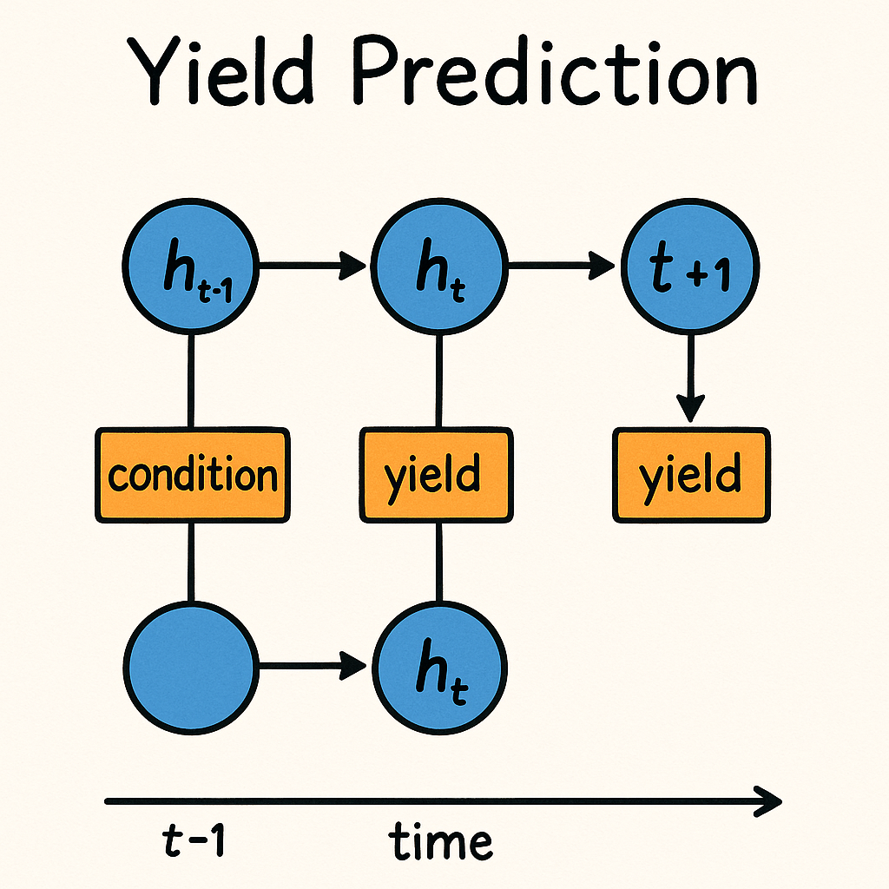
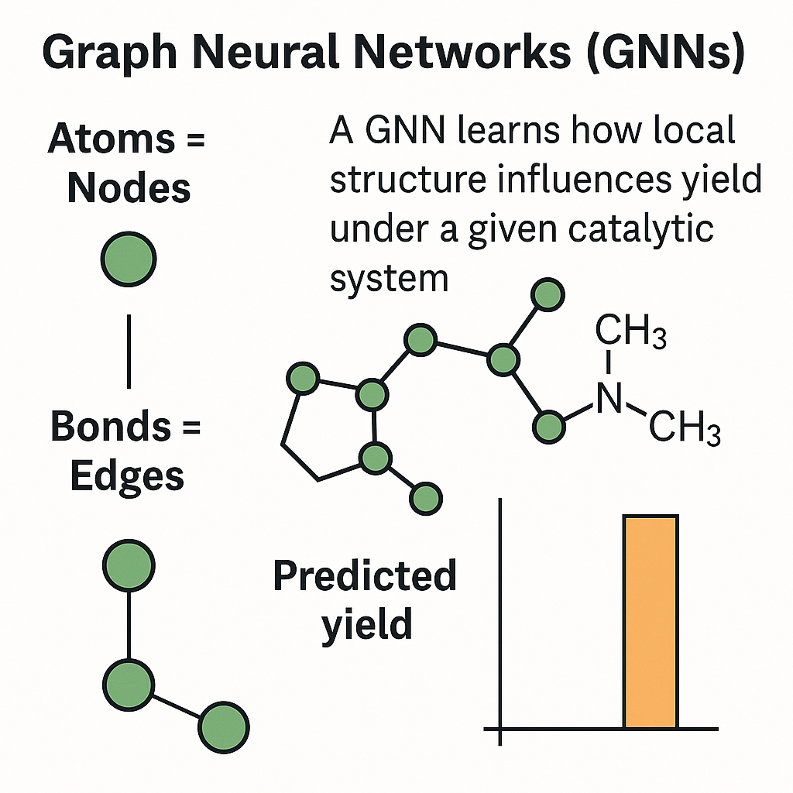
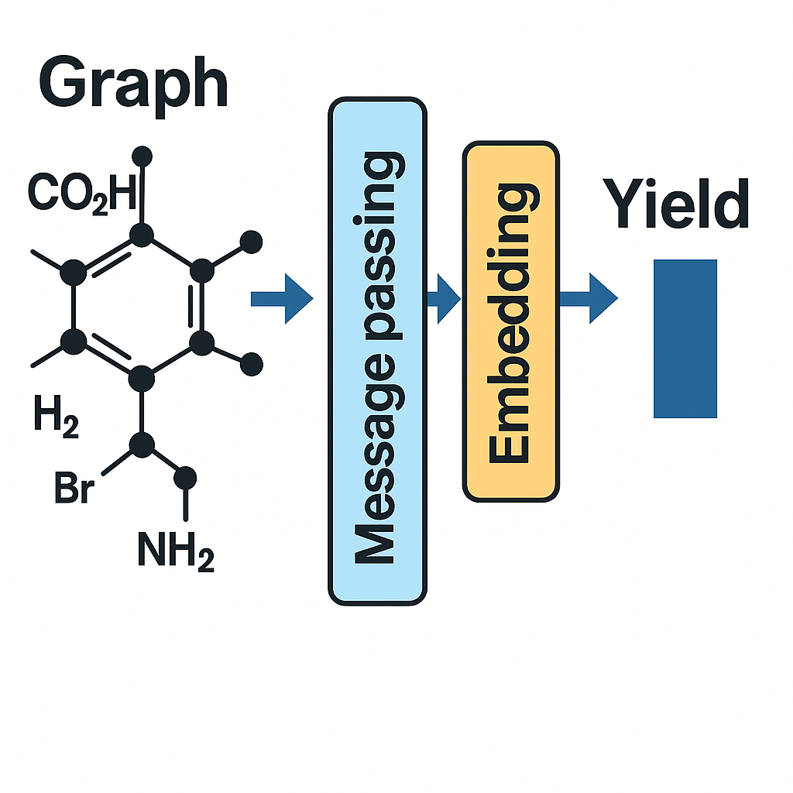

Yield prediction in chemistry involves estimating the outcome of a chemical reaction under specific conditions. 
Modern machine learning methods, including recurrent neural networks (RNNs), graph neural networks (GNNs), 
random forests, and neural networks, have significantly enhanced yield prediction by capturing complex patterns
from experimental data. In this section, we explore these four model families, understand why chemists use them,see a very small PyTorch demo for each deep‑learning model that illustrate their strengths and trade-offs. 

---

## 8.1 Recurrent Neural Networks (RNNs)

### Why RNNs make chemical sense  
Chemical processes often have an inherent sequence or time-series aspect. For example, reaction conditions
can change over time (temperature or pH profiles). An RNN is well-suited
to such data because it “remembers” previous time steps when predicting the next. In a chemistry context:  

- **Temporal Reaction Data**: If a reaction’s progress (e.g. conversion or yield over time) is recorded, an
RNN can model the trend and forecast the final outcome. It treats time-course data points as a
sequence, capturing dependencies between early events and later yield.  

- **Process Control**: In chemistry, conditions (flow rates, concentrations, temperature) vary with time. 
RNNs have been used to model kinetics in these systems, helping maintain optimal yields in real-time control scenarios.  

In essence, RNNs make chemical sense whenever past reaction information influences future behavior. They
extend standard neural networks with an internal state (memory) that carries information across the
sequence of inputs.
### Concept of RNNs
A recurrent neural network processes input sequentially, updating an internal hidden state at each step. At a given time step, an RNN takes the current input (e.g. a measurement at time t) and the hidden state from time t–1, and produces an output and a new hidden state. This design enables RNNs to capture temporal dependencies because an early event in the sequence can affect the prediction at a later time. Chemists find this useful for modeling reaction profiles because the network can, for example, learn that a temperature spike at the beginning might lead to a higher yield at the end.  

There are variations like Long Short-Term Memory (LSTM) that address issues of standard (“vanilla”) RNNs, such as the tendency for gradients to vanish over long sequences, which means when you train the RNN by going backward through dozens of time-steps, the signals used to update the earliest weights become so tiny that the network “forgets” anything that happened at the start of the sequence. These gated RNNs can retain long-range information better, which is valuable if a reaction’s outcome depends on something that happened hours earlier. For typical laboratory reactions with sequences of moderate length (e.g. a 10-hour run logged hourly), vanilla RNNs can suffice, but more complex sequences may require LSTM/GRU to handle long-term memory.  

IMAGE 1

### Example Application
Imagine a reaction run in a flow reactor where we monitor the conversion % each hour for 8 hours. We want to predict the final isolated yield at the end of the process. An RNN can be trained on historical runs of the reactor: the input would be the time-series of conversion or other sensor readings, and the target is the final yield. By learning from many such sequences, the RNN can start to predict whether, say, a slow start in conversion is likely to lead to a low final yield, or if a certain pattern of spikes in temperature improves the yield.  
For instance, RNN models have been applied in pharmaceutical process development to model reaction kinetics in continuous flow systems, where controlling the reaction over time is crucial to maximize yield. In these cases, the RNN effectively learns the dynamic relationship between time-dependent conditions and the ultimate yield, providing chemists with a tool to forecast final outcomes from partial progress data.  

**RNN Diagram**  


### Advantages
- **Captures Temporal Patterns**: RNNs excel at modeling sequential data. They can learn how earlier time points in a reaction influence later time points and final results.  
- **Dynamic Prediction**: As the RNN processes each new measurement (e.g. hourly temperature or conversion), you can “pause” the sequence and ask it for a yield estimate based on what it’s seen so far. For instance, after 2 hours of data the RNN might predict a 40 % final yield; by hour 4 it updates that to 55 %; and at hour 8 it refines to 65 %. This lets you make in fast decisions like add more catalyst or change temperature before the reaction finishes.  
- **Flexible Input Length**: RNNs can handle sequences of varying length (e.g. a reaction monitored for 5 hours vs. 10 hours) by processing one step at a time, making them versatile for different processes.  

### Limitations
- **Data Requirements**: Training RNNs typically requires a substantial amount of sequential data. If most reactions in your dataset are only recorded as final yields (no time series of intermediate data), RNNs can’t be directly applied.  
- **Vanishing Gradients on Long Sequences**: Standard RNNs can struggle with very long sequences due to vanishing or exploding gradients, making it hard to learn long-range dependencies. Architectural improvements like LSTM mitigate this but add complexity.  
- **Complexity for Beginners**: The mathematical formulation of RNNs (with looping states and backpropagation through time) is more complex than a simple feed-forward network. This can be challenge for those new to machine learning.  

### Simple Python Snippet

```python
    import os
    import pandas as pd
    import numpy as np
    import torch
    import torch.nn as nn
    from sklearn.model_selection import train_test_split

    # 1. Data Loading & Preprocessing
    csv_file = "buchwald_hartwig_yields.csv"
    if not os.path.exists(csv_file):
        print("Dataset not found. Please download 'buchwald_hartwig_yields.csv' and place it in the working directory.")

    # Read the dataset
    df = pd.read_csv(csv_file)
    df = df.dropna()  

    # Create dictionaries to map each categorical value to an index
    ligands = df["Ligand"].astype(str).unique().tolist()
    bases = df["Base"].astype(str).unique().tolist()
    aryl_halides = df["Aryl halide"].astype(str).unique().tolist()
    additives = df["Additive"].astype(str).unique().tolist()

    # Create a unified vocabulary for all categories
    # We prepend category-specific prefixes to ensure uniqueness and clarity
    vocab = {}
    idx = 0
    for cat, values in [("Ligand", ligands), ("Base", bases), ("ArylHalide", aryl_halides), ("Additive", additives)]:
        for val in values:
            token = f"{cat}:{val}"
            if token not in vocab:
                vocab[token] = idx
                idx += 1

    # Encode each reaction's features as a sequence of token indices
    sequences = []
    yields = []
    for _, row in df.iterrows():
        seq_tokens = [
            vocab[f"ArylHalide:{row['Aryl halide']}"],
            vocab[f"Ligand:{row['Ligand']}"],
            vocab[f"Base:{row['Base']}"],
            vocab[f"Additive:{row['Additive']}"]
        ]
        sequences.append(seq_tokens)
        yields.append(row["Yield"] if "Yield" in row else row["Output"])  # handle different column name for yield

    sequences = np.array(sequences)
    yields = np.array(yields, dtype=np.float32)

    # Convert to PyTorch tensors
    X = torch.tensor(sequences, dtype=torch.long)
    y = torch.tensor(yields, dtype=torch.float).view(-1, 1)

    # Train-test split
    X_train, X_test, y_train, y_test = train_test_split(X, y, test_size=0.2, random_state=42)

    # 2. Model Definition: Embedding + LSTM + Dense
    class YieldRNN(nn.Module):
        def __init__(self, vocab_size, embed_dim=32, hidden_dim=64):
            super(YieldRNN, self).__init__()
            self.embedding = nn.Embedding(vocab_size, embed_dim)
            self.lstm = nn.LSTM(embed_dim, hidden_dim, batch_first=True)
            self.fc = nn.Linear(hidden_dim, 1)  # output a single yield value
            
        def forward(self, x):
            # x shape: (batch_size, seq_length=4)
            embeds = self.embedding(x)            # (batch, seq, embed_dim)
            lstm_out, _ = self.lstm(embeds)       # (batch, seq, hidden_dim)
            # Use the final LSTM hidden state for regression:
            last_hidden = lstm_out[:, -1, :]      # (batch, hidden_dim)
            out = self.fc(last_hidden)            # (batch, 1)
            return out

    model = YieldRNN(vocab_size=len(vocab))
    criterion = nn.MSELoss()
    optimizer = torch.optim.Adam(model.parameters(), lr=0.001)

    # 3. Training loop
    epochs = 10
    model.train()
    for epoch in range(epochs):
        optimizer.zero_grad()
        outputs = model(X_train)
        loss = criterion(outputs, y_train)
        loss.backward()
        optimizer.step()
        if epoch % 2 == 0:  # print loss every 2 epochs
            print(f"Epoch {epoch}: Train MSE = {loss.item():.4f}")

    # Evaluation on test set
    model.eval()
    with torch.no_grad():
        preds = model(X_test)
        test_mse = criterion(preds, y_test).item()
        print(f"Test MSE: {test_mse:.4f}")

```

---

### Section 8.1 – Quiz Questions

#### 1) Factual Questions

##### Question 1  

Which PyTorch class provides a fully connected layer that applies a linear transformation to input data?
**A.** `nn.Linear`   
**B.** `nn.RNN`   
**C.** `nn.Conv1d`   
**D.** `nn.BatchNorm1d`   

<details><summary>▶ Click to show answer</summary>Correct Answer: A</details>  
<details><summary>▶ Click to show explanation</summary>`nn.Linear` applies a linear transformation y = xA^T + b to the incoming data, making it the standard fully connected layer in neural networks</details>

---


##### Question 3  

A common training problem with vanilla RNNs on very long sequences is:  
**A.** Over-smoothing of graph topology  
**B.** Vanishing or exploding gradients  
**C.** Excessive GPU memory during inference  
**D.** Mandatory one-hot encoding of inputs  

<details><summary>▶ Click to show answer</summary>Correct Answer: B</details>  
<details><summary>▶ Click to show explanation</summary>Gradients can shrink (or blow up) across many time-steps, making learning unstable.</details>

---

#### 2) Comprehension / Application Questions

##### Question 4  

Which of the following is an example application of RNNs?  
**A.** Modeling atom-level interactions in molecular graphs  
**B.** Modeling reaction kinetics in continuous pharmaceutical manufacturing  
**C.** Classifying reaction product color from images  
**D.** Embedding molecules using graph convolutional layers  

<details><summary>▶ Click to show answer</summary>Correct Answer: B</details>  
<details><summary>▶ Click to show explanation</summary>Gated units (GRU/LSTM) mitigate vanishing gradients on long sequences.</details>

---

##### Question 5  

If you change `hidden_dim` from 64 → 32 without altering anything else, you primarily reduce:  
**A.** The number of time-steps processed  
**B.** Model capacity (fewer parameters)  
**C.** Training epochs required  
**D.** Sequence length  

<details><summary>▶ Click to show answer</summary>Correct Answer: B</details>  
<details><summary>▶ Click to show explanation</summary>Smaller hidden vectors mean fewer weights and less representational power.</details>

---

## 8.2 Graph Neural Networks (GNNs)

### Why GNNs make chemical sense  
Many chemical problems are best described by graphs: molecules are graphs of atoms (nodes) connected by bonds (edges). In a reaction context, we have multiple molecules interacting. Graph neural networks are designed to operate on graph-structured data, which aligns with chemistry in several ways:  
- **Molecular Representation**: Unlike a fixed-size fingerprint or descriptor vector, GNNs can take the actual molecular graph as input. This avoids manual feature engineering which mean the model can learn directly from the structure (connectivity, atom types). For yield prediction, this means a GNN could directly consider the structures of reactants, catalyst in their native graph form.  

- **Variable-Size Inputs**: Each reaction can have molecules of varying sizes. GNNs naturally handle this because they produce an embedding (vector) for a whole graph regardless of the number of atoms – effectively mapping a variable-size molecule to a fixed-length representation by aggregating over its nodes. This size-invariance is crucial in chemistry, where one reaction’s molecule may have 10 atoms and another’s 30.  

- **Locality of Chemical Effects**: GNNs use a concept called message passing, where each atom updates its state based on neighboring atoms iteratively. This mimics how local chemical environment influences properties: for example, an electron-withdrawing group on an aromatic ring affects the reactivity of that ring’s other positions mostly through local inductive or resonance effects. GNNs naturally capture such locality – after a few message-passing steps, an atom’s state encodes information about the atoms in its vicinity (neighbors, neighbors of neighbors). This is highly relevant for reactions, as yield might depend on the local functional groups around the reactive site.  

In summary, GNNs see molecules like a chemist does (as graphs) and thus make sense for chemistry. They have indeed been shown to improve reaction yield predictions by better capturing structural effects  

**How a GNN Sees a Molecule and Outputs Yield**  



### Concept
A Graph Neural Network operates by iteratively updating node feature vectors. Initially, each node (atom) can be described by features such as atom type, degree. In each message passing round (or GNN layer), each node gathers feature information from its neighbors (the connected atoms) and uses a neural network to update its own feature vector. After several rounds, each node’s vector contains information about its local substructure.  

After updating node features, we need a readout or pooling step to get a fixed-size representation for the whole graph (molecule or reaction). Common readouts include simple averaging of node vectors, summation. This graph-level vector can then be fed into further layers or used for prediction. For reaction yield, one could combine the graph representations of all reaction components to output a yield prediction.   

Think of a GNN as a way to compute molecular descriptors on the fly: instead of predefined fingerprints, the model learns its own features that are optimal for predicting yield. For example, a GNN might learn an embedding that captures a complicated structure without us explicitly coding that rule, it can infer it from data.

**Inside a GNN: Message-Passing → Update → Read-out Pipeline**  


### Example Application
A GNN-based approach to predict yield could involve the following steps:
- **Molecular Graphs**: Convert each reactant molecule into a graph. For instance, represent the structure as a graph of atoms and bonds.  
- **Graph Embeddings**: Use a GNN to compute an embedding for each molecule. For simplicity, you might train one GNN model that takes any molecule and produces a vector.  
- **Reaction Embedding**: Combine the embeddings of the reactants for example, concatenate or sum them in order to get a representation of the entire reaction setup.
- **Yield Prediction**: Feed this reaction representation into a regression model (like a feed-forward neural network) to predict the yield. Such a model can capture subtle effects. They can learn interaction effects, because the graph representation can encode those functional groups explicitly.  
### Advantages
- **Direct use of chemical structure**: No need for manual descriptors, the model learns from raw structures, potentially discovering new relevant features.
- **Expressive power**: GNNs can, in principle, approximate complex functions on graphs, meaning they can capture non-linear structure–yield relationships that simpler models might miss.
- **Handling Novel Molecules**: Because GNNs don’t rely on a fixed fingerprint dictionary, they can better handle molecules that weren’t in the training set (assuming similar chemistry). The model will still produce an embedding by message passing, whereas a fixed fingerprint might miss an unseen substructure.

### Limitations
- **Data Hungry**: GNNs typically have a lot of parameters and may require large datasets to avoid overfitting. If you have only a few dozen reaction examples, a GNN might overfit; the BH dataset with a few thousand entries is borderline and techniques like pre-training on large molecular datasets can help.  
- **Computational Cost**: Operating on graphs is generally slower than computing a simple fingerprint. Training GNNs can be more time-consuming .
- **Expertise Barrier**: Implementing and tuning GNN models (choosing number of message passing steps, handling multiple molecules in a reaction) is complex.  
- **Multiple Graphs Combination**: In reaction yield tasks, you often have multiple distinct molecules. There’s a design decision whether to combine them into one graph or process each separately and combine embeddings. Both approaches add complexity.

### Simple Python Snippet
```python
    # 0.  Imports & CSV ───────────────────────────────────────────
    import os, pandas as pd, torch
    from rdkit import Chem
    from torch_geometric.data import Data, Batch
    from torch_geometric.nn import GraphConv, global_mean_pool

    csv = "buchwald_hartwig_yields.csv"
    assert os.path.exists(csv), "Put the BH CSV in this folder first."
    df = pd.read_csv(csv).dropna()

    # 1.  SMILES → simple graph  (atom-number feature, bond edges)
    def smiles_to_graph(smiles: str) -> Data:
        mol = Chem.MolFromSmiles(smiles)
        if mol is None:                       # skip bad rows
            return None
        x = torch.tensor([[a.GetAtomicNum()] for a in mol.GetAtoms()],
                        dtype=torch.float)   # 1-dim feature = Z
        edge_index = []
        for b in mol.GetBonds():              # undirected edges
            i, j = b.GetBeginAtomIdx(), b.GetEndAtomIdx()
            edge_index += [[i, j], [j, i]]
        edge_index = torch.tensor(edge_index, dtype=torch.long).t().contiguous()
        return Data(x=x, edge_index=edge_index)

    # 2.  Build a graph per *whole reaction* (merge 4 components)
    graphs = []
    for _, r in df.iterrows():
        comps = [r["Aryl halide"], r["Ligand"], r["Base"], r["Additive"]]
        pieces = [smiles_to_graph(s) for s in comps]
        if any(p is None for p in pieces):
            continue
        offset, xs, es = 0, [], []
        for g in pieces:
            es.append(g.edge_index + offset)
            xs.append(g.x)
            offset += g.x.size(0)
        G = Data(x=torch.cat(xs),
                edge_index=torch.cat(es, dim=1),
                y=torch.tensor([r["Yield"]], dtype=torch.float))
        graphs.append(G)

    # 3.  Train / test split & batching
    train_split = int(0.8*len(graphs))
    train_set, test_set = graphs[:train_split], graphs[train_split:]

    def batch(loader):
        return Batch.from_data_list(loader)

    train_batch = batch(train_set)
    test_batch  = batch(test_set)

    # 4.  Minimal 2-layer GNN model
    class YieldGNN(torch.nn.Module):
        def __init__(self, hidden=64):
            super().__init__()
            self.conv1 = GraphConv(1, hidden)
            self.conv2 = GraphConv(hidden, hidden)
            self.reg   = torch.nn.Linear(hidden, 1)
        def forward(self, data):
            x = torch.relu(self.conv1(data.x, data.edge_index))
            x = torch.relu(self.conv2(x,     data.edge_index))
            x = global_mean_pool(x, data.batch)      # graph -> vector
            return self.reg(x)

    model = YieldGNN()
    opt   = torch.optim.Adam(model.parameters(), lr=1e-3)
    lossf = torch.nn.MSELoss()

    # 5.  Quick training loop
    for epoch in range(5):
        model.train()
        opt.zero_grad()
        loss = lossf(model(train_batch), train_batch.y)
        loss.backward(); opt.step()
        print(f"Epoch {epoch+1}: train MSE {loss.item():.3f}")

    # 6.  Test performance
    model.eval()
    with torch.no_grad():
        test_mse = lossf(model(test_batch), test_batch.y).item()
    print(f"Test MSE: {test_mse:.3f}")
```

---

### Section 8.2 – Quiz Questions (Graph Neural Networks)

#### 1) Factual Questions

##### Question 1  

In a molecular graph, nodes typically represent:  
**A.** Bonds  
**B.** Atoms  
**C.** Ring systems  
**D.** IR peaks  

<details><summary>▶ Click to show answer</summary>Correct Answer: B</details>  
<details><summary>▶ Click to show explanation</summary>Atoms are mapped to nodes; bonds form edges connecting them.</details>

---

##### Question 2

A key advantage of GNNs for chemistry is their ability to:  
**A.** Ignore local atomic environments  
**B.** Map variable-size molecules to fixed-length vectors  
**C.** Require explicit reaction conditions  
**D.** Operate only on tabular data  

<details><summary>▶ Click to show answer</summary>Correct Answer: B</details>  
<details><summary>▶ Click to show explanation</summary>Message passing aggregates information into a size-invariant embedding.</details>

---

#### 2) Comprehension / Application Questions

##### Question 3 

You have reaction SMILES without 3-D coordinates.  
Can you still train a GNN?  
**A.** Yes – connectivity alone often works  
**B.** No – 3-D is mandatory  
**C.** Only after DFT optimisation  
**D.** Only with image data  

<details><summary>▶ Click to show answer</summary>Correct Answer: A</details>  
<details><summary>▶ Click to show explanation</summary>Most GNNs operate on 2-D graphs derived directly from SMILES.</details>

---


## 8.3 Random Forests

### Concept
Random Forests are ensemble methods combining multiple decision trees. They aggregate predictions from various decision trees to enhance accuracy and reduce overfitting.

### Example Application
Successfully predicted yields for chemical synthesis reactions such as pyrroles and dipyrromethanes, highlighting how different reagents affect reaction outcomes.

### Advantages
- Intuitive and easy to implement.  
- Good accuracy and robustness with noisy data.

### Limitations
- Less effective with extremely large datasets.  
- Interpretability can decrease with increasing complexity.

### Simple Python Snippet
```python
from sklearn.ensemble import RandomForestRegressor
import numpy as np
np.random.seed(0)

X = np.random.rand(100, 6)   # 6 engineered features (e.g: MW, logP, base pKa…)
y = np.random.rand(100)      # yields 0‑1

rf = RandomForestRegressor(n_estimators=200, oob_score=True, random_state=0)
rf.fit(X, y)

print("OOB R² :", rf.oob_score_)
print("sample prediction:", rf.predict(X[:1])[0])
```

---

### Section 8.3 – Quiz Questions (Random Forests)

#### 1) Factual Questions

##### Question 1  

Random Forests are an ensemble of:  
**A.** Linear regressors  
**B.** Decision trees  
**C.** k-Means clusters  
**D.** Support-vector machines  

<details><summary>▶ Click to show answer</summary>Correct Answer: B</details>
<details><summary>▶ Click to show explanation</summary>They combine many decision trees to improve predictive accuracy and reduce overfitting compared to a single tree.</details>

---

##### Question 2  

The attribute `oob_score_` printed in the snippet reports. What does oob stand for? :  
**A.** Over-optimised benchmark  
**B.** Out-of-bag R² estimate  
**C.** Observed-only bias  
**D.** Objective batching ratio  

<details><summary>▶ Click to show answer</summary>Correct Answer: B</details>
<details><summary>▶ Click to show explanation</summary>`oob_score_` uses the samples not included in each bootstrap (“out-of-bag” data) to compute an R² score, giving a built-in estimate of generalization without a separate validation set.</details>

---

##### Question 3  

Which hyper-parameter chiefly controls tree diversity in a Random Forest?  
**A.** `n_estimators`  
**B.** `criterion`  
**C.** `max_depth`  
**D.** `random_state`  

<details><summary>▶ Click to show answer</summary>Correct Answer: A</details>  
<details><summary>▶ Click to show explanation</summary>More estimators = more trees, boosting ensemble variance reduction.</details>

---

#### 2) Comprehension / Application Questions

##### Question 4  

Why are Random Forests a popular baseline for small tabular datasets?  
**A.** They need deep chemical insight  
**B.** They train quickly with minimal tuning  
**C.** They require sequential temperature data  
**D.** They embed quantum mechanics  

<details><summary>▶ Click to show answer</summary>Correct Answer: B</details>
<details><summary>▶ Click to show explanation</summary>Random Forests handle varied feature types, are robust to noise, and generally perform well out of the box with little hyperparameter tuning.</details>

---

##### Question 5  

Your forest overfits. Which tweak most likely reduces overfitting?  
**A.** Increase `max_depth`  
**B.** Decrease `max_depth`  
**C.** Disable bootstrapping  
**D.** Remove feature engineering  

<details><summary>▶ Click to show answer</summary>Correct Answer: B</details>  
<details><summary>▶ Click to show explanation</summary>Shallow trees generalise better by limiting each tree’s complexity.</details>

---

## 8.4 Neural Networks

### Concept
Neural networks mimic biological neurons and connections, capable of capturing nonlinear and complex relationships. They typically consist of input layers, hidden layers, and output layers.

### Example Application
Used broadly to predict chemical reaction outcomes, learning from experimental data to forecast yields even for reactions with complex mechanisms.

### Advantages
- Powerful in modeling complex, nonlinear relationships.  
- Flexible architectures applicable to various chemical prediction tasks.

### Limitations
- Requires significant computational resources.  
- Needs large datasets for effective training.

### Simple Python Snippet
```python
import torch, torch.nn as nn, torch.optim as optim
torch.manual_seed(1)

X = torch.rand(120, 8)   # 8 engineered descriptors per reaction
y = torch.rand(120, 1)   # yields

model = nn.Sequential(
    nn.Linear(8, 32), nn.ReLU(),
    nn.Linear(32, 16), nn.ReLU(),
    nn.Linear(16, 1)
)

loss_fn = nn.MSELoss()
opt = optim.Adam(model.parameters(), lr=1e-2)

for epoch in range(80):
    y_hat = model(X)
    loss = loss_fn(y_hat, y)
    opt.zero_grad(); loss.backward(); opt.step()

print("final loss:", loss.item())
print("predicted yield (first sample):", y_hat[0].item())
```

---

### Section 8.4 – Quiz Questions (Feed-forward Neural Networks)

#### 1) Factual Questions

##### Question 1  

Which activation function is explicitly used in the MLP snippet?  
**A.** Sigmoid  
**B.** Tanh  
**C.** ReLU  
**D.** Softmax  

<details><summary>▶ Click to show answer</summary>Correct Answer: C</details>
<details><summary>▶ Click to show explanation</summary>The code uses `nn.ReLU()` between layers to introduce non-linearities.</details>

---

##### Question 2  

The MLP architecture shown contains how many hidden layers?  
**A.** 1  
**B.** 2  
**C.** 3  
**D.** 0  

<details><summary>▶ Click to show answer</summary>Correct Answer: B</details>  
<details><summary>▶ Click to show explanation</summary>Two `nn.Linear` layers sit between input and output.</details>

---

##### Question 3  

A key limitation of generic feed-forward NNs in chemistry is:  
**A.** Inability to model non-linear relations  
**B.** Need for large datasets to avoid overfitting  
**C.** Zero computational cost  
**D.** Mandatory graph inputs  

<details><summary>▶ Click to show answer</summary>Correct Answer: B</details>
<details><summary>▶ Click to show explanation</summary>Neural networks have many parameters and can easily overfit small datasets, requiring large amounts of data for reliable generalization.</details>

---

#### 2) Comprehension / Application Questions

##### Question 4  

Doubling every hidden-layer size without adding data mainly risks:  
**A.** Vanishing gradients  
**B.** Underfitting  
**C.** Overfitting  
**D.** Slower I/O  

<details><summary>▶ Click to show answer</summary>Correct Answer: C</details>
<details><summary>▶ Click to show explanation</summary>Increasing model capacity without more data often leads to overfitting, where the network memorizes noise instead of learning general patterns.</details>

---

##### Question 5  

What operation does `nn.MSELoss()` perform behind the scenes?  
**A.** Computes cross-entropy between predicted probabilities and one-hot targets  
**B.** Calculates the average of squared differences between predicted and actual values  
**C.** Computes binary cross-entropy loss for binary classification  
**D.** Calculates negative log-likelihood of predicted distributions  

<details><summary>▶ Click to show answer</summary>Correct Answer: B</details>  
<details><summary>▶ Click to show explanation</summary>MSELoss measures how far off your predictions are by taking each prediction’s error (prediction minus true value), squaring it (to penalize larger mistakes more), and then averaging all those squared errors into one overall score.</details>


